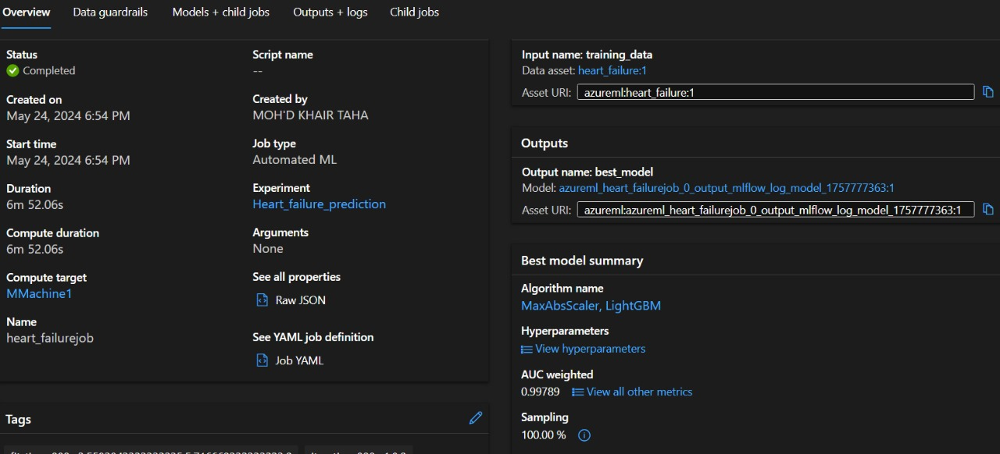
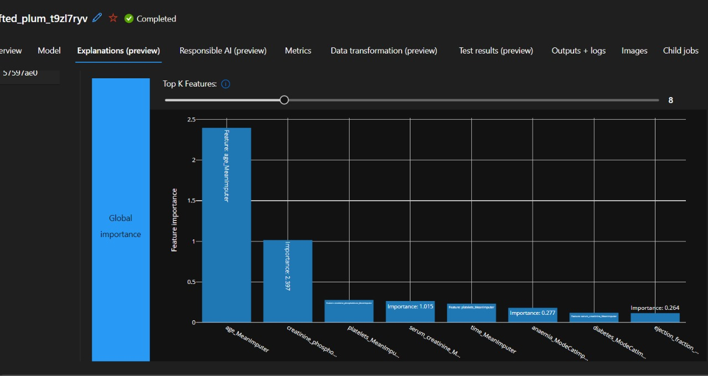

# Heart Failure Prediction: KNN & Azure AutoML

Predicting **mortality in heart-failure patients** from 12 clinical features, using two approaches:

1. **A hand-built pipeline:** K-Nearest Neighbors with feature selection, class balancing, normalization and 10-fold cross-validation, logged with **MLflow**.
2. **A cloud pipeline:** **Azure Machine Learning Automated ML**, which picked a LightGBM model and produced deployable scoring artifacts.

It also includes a simple **rule-based chatbot** that explains the dataset's features to non-technical users.

> Artificial Intelligence course project, Al Hussein Technical University (Spring 2023/2024)

## Dataset

`heart_failure_clinical_records.csv` has **5,000 patient records** with 12 features and a binary target. It is an extended version of the [UCI Heart Failure Clinical Records](https://archive.ics.uci.edu/dataset/519/heart+failure+clinical+records) dataset.

| Feature | Description |
|---------|-------------|
| `age` | Patient age (years) |
| `anaemia` | Decrease of red blood cells / hemoglobin (0/1) |
| `creatinine_phosphokinase` | CPK enzyme level (mcg/L) |
| `diabetes` | Has diabetes (0/1) |
| `ejection_fraction` | % of blood leaving the heart per contraction |
| `high_blood_pressure` | Has hypertension (0/1) |
| `platelets` | Platelets in the blood (kiloplatelets/mL) |
| `serum_creatinine` | Serum creatinine level (mg/dL) |
| `serum_sodium` | Serum sodium level (mEq/L) |
| `sex` | Male / female (0/1) |
| `smoking` | Smoker (0/1) |
| `time` | Follow-up period (days) |
| **`DEATH_EVENT`** | **Target:** patient died during follow-up (0/1) |

## 1. KNN Pipeline

**Steps:** feature selection with `SelectKBest(f_classif)` → optional upsampling of the minority class → optional Min-Max normalization → 80/20 train/test split → `KNeighborsClassifier` → 10-fold CV on the training set plus evaluation on the test set.

### Results (test set)

| Data variant | Accuracy | Precision | Recall | F1 |
|--------------|---------:|----------:|-------:|---:|
| Original | 0.934 | 0.934 | 0.934 | 0.934 |
| Balanced | 0.943 | 0.944 | 0.943 | 0.943 |
| **Normalized** | **0.969** | **0.969** | **0.969** | **0.969** |

Normalization gives the biggest improvement. KNN is distance-based, so unscaled features such as `platelets` (hundreds of thousands) otherwise drown out the binary features.

Precision, recall and F1 are weighted averages. The final notebook section (normalized and balanced) builds its split from the normalized data, so it reproduces the normalized results. That run is also tracked with MLflow.

## 2. Azure Automated ML

The same dataset was registered as a data asset in **Azure Machine Learning Studio**, and an AutoML classification job was run with `DEATH_EVENT` as the target.

| | |
|---|---|
| Best algorithm | **MaxAbsScaler + LightGBM** |
| AUC (weighted) | **0.998** |
| Job duration | ~7 minutes |

| Job overview | Feature importance |
|---|---|
|  |  |

The exported artifacts in [`azure-automl/`](azure-automl/) are:

- `model.pkl`: the trained AutoML model
- `scoring_file_v_2_0_0.py`: the entry script for an Azure ML online endpoint
- `conda_env_v_1_0_0.yml`: the inference environment

More screenshots are in [`images/`](images/).

## 3. Dataset Support Chatbot

[`chatbot/dataset_support_chatbot.ipynb`](chatbot/dataset_support_chatbot.ipynb) is a keyword-matching chatbot. It greets the user, explains any feature of the dataset in plain language and handles goodbyes. It shows the strengths of a rule-based system (it is predictable and fast) and its limits (no context and no understanding of language), which the report discusses alongside NLP-based alternatives.

## Repository Structure

```
├── data/
│   └── heart_failure_clinical_records.csv
├── notebooks/
│   └── heart_failure_knn.ipynb        # KNN pipeline + MLflow
├── models/
│   └── knn_model.pkl                  # KNN model logged by MLflow
├── azure-automl/                      # Exported AutoML model and scoring files
├── chatbot/
│   └── dataset_support_chatbot.ipynb
├── images/                            # Azure ML Studio screenshots
├── docs/
│   └── Technical_Report.docx          # Full report (incl. AI deployment approaches)
└── requirements.txt
```

## Getting Started

```bash
git clone https://github.com/mohdkhairs4/Heart-Failure-Prediction-KNN-and-Azure-AutoML.git
cd Heart-Failure-Prediction-KNN-and-Azure-AutoML
pip install -r requirements.txt
jupyter notebook notebooks/heart_failure_knn.ipynb
```

The notebook was written in Google Colab and reads `/content/heart_failure_clinical_records.csv`. Upload the CSV from `data/` to Colab, or change the path to `../data/heart_failure_clinical_records.csv` when running locally.

Loading `azure-automl/model.pkl` requires the Azure ML packages listed in `conda_env_v_1_0_0.yml`.

## Tech Stack

Python · pandas · scikit-learn · MLflow · Azure Machine Learning (AutoML) · LightGBM · Google Colab

## Author

**Mohd Khair Jamal Taha**, [GitHub](https://github.com/mohdkhairs4)
